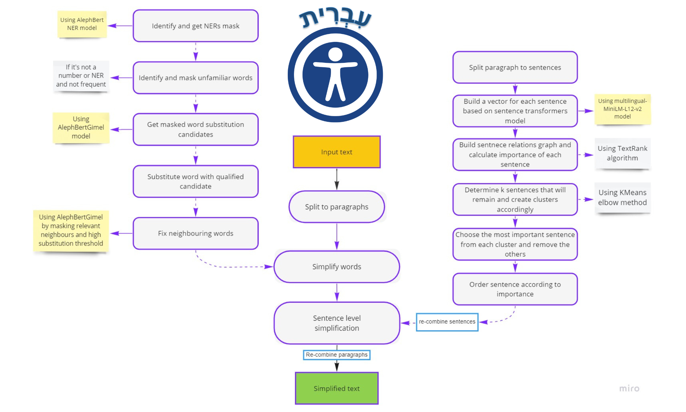
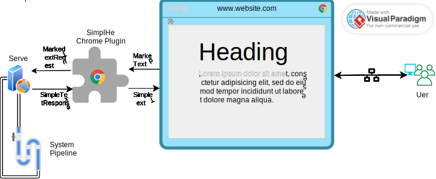

# SimplHe: Automatic Text Simplification System

SimplHe is an Automatic Text Simplification system designed specifically for the Hebrew language. It aims to enhance the readability and understandability of complex Hebrew text by reducing structural complexity, length, and the use of unfamiliar words. By leveraging Machine Learning and Natural Language Processing techniques, SimplHe provides a user-friendly solution that may assist individuals with weak language skills, such as young children or those facing linguistic challenges.

## Key Features

- Text Simplification: SimplHe modifies Hebrew text to make it more accessible and easier to comprehend.
- Plugin for Google Chrome: The system is implemented as a plugin for the Google Chrome browser.
- Text Marking: Users can mark text with their mouse to trigger the simplification process.
- Simplified Text Window: After marking the text, a simplified text window pops up, displaying the modified version of the text.
- Simplification Levels: Users can choose between two simplification levels:
  - Replacing complex words with simple words without changing the meaning of the sentence.
  - Replacing the structure of the text by removing sentences that do not contribute additional information or are not relevant to the importance of the text, thus summarizing it.
  - Both simplification levels combined: Replacing complex words and simplifying sentence structure simultaneously.
- Customization Options: Users have control over the font size and color of the simplified text displayed in the new window below the original text.

## Installation and Setup

To set up SimplHe on your local machine, please follow these steps:
1. Install [**`python 3.9.13`**](https://www.python.org/downloads/release/python-3913/)
2. Navigate to the directory to place the project in
3. Open a terminal
4. Execute the following commands in the terminal (must have [`git`](https://git-scm.com/downloads) installed):

```bash
~ git clone https://github.com/bilbisli/hebrew_text_simplification.git
~ cd hebrew_text_simplification
~ py -3.9 -m venv ts_env
~ .\ts_env\Scripts\activate # command for windows; for POSIX run: source ts_env/bin/activate
~ pip install -r requirements.txt
~ python .\ChromePlugin\manage.py runserver   # this may take a while, especially at the first run due to models loading
```

After running the `python .\ChromePlugin\manage.py runserver` command, the SimplHe system will start, and you can proceed to the next steps.

## Usage

Once the SimplHe system is up and running, follow these instructions to use the plugin:

1. Launch the Google Chrome browser.
2. Navigate to the web page or document containing the Hebrew text you wish to simplify.
3. Select the text you want to simplify by marking it with your mouse.
4. After marking the text, a simplified text window will automatically pop up.
5. In the simplified text window, choose the desired simplification level by clicking on the appropriate option:
   - Replace complex words: This level replaces complex words with simpler alternatives while preserving the sentence's original meaning.
   - Replace sentence structure: This level removes sentences that do not contribute additional information or are not relevant to the text's importance, effectively summarizing it.
   - Replace complex words and sentence structure: This level combines both simplification levels, offering a comprehensive simplification of the text.
6. Customize the appearance of the simplified text by adjusting the font size and color as per your preference.
7. Read and comprehend the simplified text in the new window below the original text.


## System Pipeline



## System Architecture



## Support and Contribution

For any issues, questions, or feedback regarding the SimplHe system, please refer to the GitHub repository [bilbisli/hebrew_text_simplification](https://github.com/bilbisli/hebrew_text_simplification). You can open a new issue or contribute to the project by following the guidelines provided in the repository.

*Please note that SimplHe is a research project and should be used accordingly

